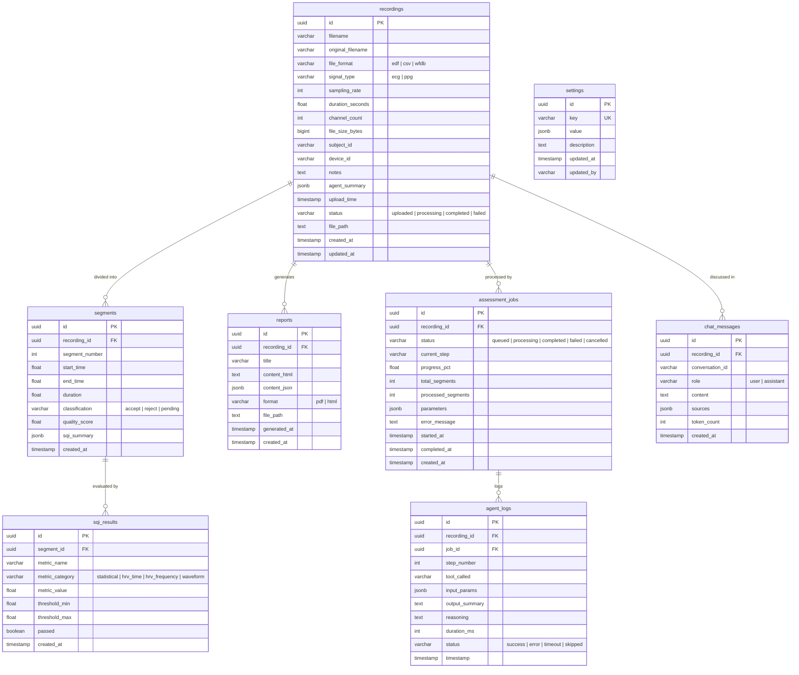

# 11 — Data Model

[← Back to Index](00-index.md)

---

## Overview

This document defines the PostgreSQL database schema for the Agentic AI Data Quality Monitoring system. The schema stores recordings, segmentation results, signal quality index (SQI) metrics, generated reports, agent execution logs, and configurable system settings.

---

## Entity Relationship Description

### Entities and Cardinalities

```
recordings        (1) ──────< (many) segments
recordings        (1) ──────< (many) reports
recordings        (1) ──────< (many) assessment_jobs
recordings        (1) ──────< (many) chat_messages
assessment_jobs   (1) ──────< (many) agent_logs
segments          (1) ──────< (many) sqi_results
settings          (standalone, no FK relationships)
```

### ERD Diagram



**recordings → segments**: One recording is divided into many non-overlapping (or minimally overlapping) time-based segments. Each segment belongs to exactly one recording. Cascade delete: deleting a recording removes all its segments.

**segments → sqi_results**: Each segment is evaluated by multiple SQI metrics (e.g., SNR, kurtosis, perfusion index). One segment has many SQI result rows, one per metric. Cascade delete: deleting a segment removes all its SQI results.

**recordings → reports**: One recording may have zero or more generated reports (e.g., first automated report, revised report after user feedback). Cascade delete: deleting a recording removes all associated reports.

**recordings → assessment_jobs**: Each recording may have one or more async processing jobs tracking segmentation, SQI computation, and agent analysis progress. A new job is created each time the user triggers (or re-triggers) assessment. Cascade delete: deleting a recording removes all its jobs.

**assessment_jobs → agent_logs**: The agent logs every tool call and reasoning step against a specific job run. One job accumulates many log entries. Cascade delete: deleting a job removes all its agent logs.

**recordings → chat_messages**: Each chatbot conversation turn is scoped to a recording. Multiple conversations (identified by `conversation_id`) may exist for the same recording. Cascade delete: deleting a recording removes all its chat messages.

**settings**: Standalone key-value configuration store. Not linked to other entities. Provides runtime-configurable thresholds and system parameters.

---

## CREATE TABLE Statements

### 1. `recordings`

Stores uploaded biomedical signal files and their processing status.

```sql
CREATE EXTENSION IF NOT EXISTS "pgcrypto";

CREATE TABLE recordings (
    id                  UUID PRIMARY KEY DEFAULT gen_random_uuid(),
    filename            VARCHAR(255) NOT NULL,
    original_filename   VARCHAR(255) NOT NULL,
    file_format         VARCHAR(10)  NOT NULL CHECK (file_format IN ('edf', 'csv', 'wfdb')),
    signal_type         VARCHAR(5)   NOT NULL CHECK (signal_type IN ('ecg', 'ppg')),
    sampling_rate       INTEGER      NOT NULL CHECK (sampling_rate > 0),
    duration_seconds    FLOAT,
    channel_count       INTEGER      NOT NULL DEFAULT 1 CHECK (channel_count > 0),
    file_size_bytes     BIGINT       NOT NULL CHECK (file_size_bytes > 0),
    subject_id          VARCHAR(100),
    device_id           VARCHAR(100),
    notes               TEXT,
    agent_summary       JSONB,       -- Agent interpretation: {"overall_verdict": "...", "acceptance_rate": 0.72, "key_findings": [...], "recommendations": [...]}
    upload_time         TIMESTAMP    NOT NULL DEFAULT NOW(),
    status              VARCHAR(20)  NOT NULL DEFAULT 'uploaded'
                            CHECK (status IN ('uploaded', 'processing', 'completed', 'failed')),
    file_path           TEXT         NOT NULL,
    created_at          TIMESTAMP    NOT NULL DEFAULT NOW(),
    updated_at          TIMESTAMP    NOT NULL DEFAULT NOW()
);

-- Trigger to auto-update updated_at
CREATE OR REPLACE FUNCTION update_updated_at_column()
RETURNS TRIGGER AS $$
BEGIN
    NEW.updated_at = NOW();
    RETURN NEW;
END;
$$ LANGUAGE plpgsql;

CREATE TRIGGER recordings_updated_at
    BEFORE UPDATE ON recordings
    FOR EACH ROW EXECUTE FUNCTION update_updated_at_column();
```

**Indexes:**

```sql
-- Filter by processing status (most common query)
CREATE INDEX idx_recordings_status ON recordings (status);

-- Sort by upload time for recent recordings list
CREATE INDEX idx_recordings_upload_time ON recordings (upload_time DESC);

-- Filter by signal type for type-specific dashboards
CREATE INDEX idx_recordings_signal_type ON recordings (signal_type);
```

---

### 2. `assessment_jobs`

Tracks the async processing state for each recording assessment run. A new job row is inserted when the user triggers assessment; the backend updates it as processing progresses through segmentation, SQI computation, and agent analysis steps.

```sql
CREATE TABLE assessment_jobs (
    id                  UUID PRIMARY KEY DEFAULT gen_random_uuid(),
    recording_id        UUID         NOT NULL REFERENCES recordings(id) ON DELETE CASCADE,
    status              VARCHAR(20)  NOT NULL DEFAULT 'queued'
                            CHECK (status IN ('queued', 'processing', 'completed', 'failed', 'cancelled')),
    current_step        VARCHAR(50),
    progress_pct        FLOAT        DEFAULT 0 CHECK (progress_pct >= 0 AND progress_pct <= 100),
    total_segments      INTEGER,
    processed_segments  INTEGER      DEFAULT 0,
    parameters          JSONB,
    error_message       TEXT,
    started_at          TIMESTAMP,
    completed_at        TIMESTAMP,
    created_at          TIMESTAMP    NOT NULL DEFAULT NOW()
);
```

**Indexes:**

```sql
CREATE INDEX idx_assessment_jobs_recording ON assessment_jobs (recording_id);
CREATE INDEX idx_assessment_jobs_status ON assessment_jobs (status) WHERE status IN ('queued', 'processing');
```

---

### 3. `segments`

Stores time-based segments derived from each recording after segmentation.

```sql
CREATE TABLE segments (
    id               UUID PRIMARY KEY DEFAULT gen_random_uuid(),
    recording_id     UUID        NOT NULL REFERENCES recordings(id) ON DELETE CASCADE,
    segment_number   INTEGER     NOT NULL CHECK (segment_number >= 0),
    start_time       FLOAT       NOT NULL CHECK (start_time >= 0),
    end_time         FLOAT       NOT NULL,
    duration         FLOAT       NOT NULL CHECK (duration > 0),
    classification   VARCHAR(10) NOT NULL DEFAULT 'pending'
                         CHECK (classification IN ('accept', 'reject', 'pending')),
    quality_score    FLOAT       CHECK (quality_score >= 0 AND quality_score <= 1),
    sqi_summary      JSONB,      -- Denormalized cache: {"snr": 12.3, "kurtosis": 2.1, ...} for fast dashboard reads
    created_at       TIMESTAMP   NOT NULL DEFAULT NOW(),

    CONSTRAINT segments_time_order CHECK (end_time > start_time),
    CONSTRAINT segments_recording_segment_unique UNIQUE (recording_id, segment_number)
);
```

**Indexes:**

```sql
-- Primary lookup: all segments for a recording (ordered for timeline display)
CREATE INDEX idx_segments_recording_id ON segments (recording_id, segment_number ASC);

-- Filter by classification (accept/reject counts, dashboard stats)
CREATE INDEX idx_segments_classification ON segments (recording_id, classification);

-- Filter pending segments for processing queue
CREATE INDEX idx_segments_pending ON segments (classification)
    WHERE classification = 'pending';
```

---

### 4. `sqi_results`

Stores individual SQI metric values computed for each segment.

```sql
CREATE TABLE sqi_results (
    id               UUID PRIMARY KEY DEFAULT gen_random_uuid(),
    segment_id       UUID         NOT NULL REFERENCES segments(id) ON DELETE CASCADE,
    metric_name      VARCHAR(50)  NOT NULL,
    metric_category  VARCHAR(30)  NOT NULL
                         CHECK (metric_category IN ('statistical', 'hrv_time', 'hrv_frequency', 'waveform')),
    metric_value     FLOAT        NOT NULL,
    threshold_min    FLOAT,
    threshold_max    FLOAT,
    passed           BOOLEAN      NOT NULL DEFAULT FALSE,
    created_at       TIMESTAMP    NOT NULL DEFAULT NOW(),

    CONSTRAINT sqi_results_segment_metric_unique UNIQUE (segment_id, metric_name)
);
```

**Indexes:**

```sql
-- Primary lookup: all metrics for a segment
CREATE INDEX idx_sqi_results_segment_id ON sqi_results (segment_id);

-- Aggregate by metric name across recordings (trend analysis)
CREATE INDEX idx_sqi_results_metric_name ON sqi_results (metric_name);

-- Filter failed metrics for alert generation
CREATE INDEX idx_sqi_results_failed ON sqi_results (segment_id, passed)
    WHERE passed = FALSE;

-- Filter by metric category for grouped analysis
CREATE INDEX idx_sqi_results_category ON sqi_results (metric_category, metric_name);
```

---

### 5. `reports`

Stores auto-generated quality assessment reports for each recording.

```sql
CREATE TABLE reports (
    id              UUID          PRIMARY KEY DEFAULT gen_random_uuid(),
    recording_id    UUID          NOT NULL REFERENCES recordings(id) ON DELETE CASCADE,
    title           VARCHAR(255)  NOT NULL,
    content_html    TEXT,
    content_json    JSONB,
    format          VARCHAR(10)   NOT NULL DEFAULT 'html'
                        CHECK (format IN ('pdf', 'html')),
    file_path       TEXT,
    generated_at    TIMESTAMP     NOT NULL DEFAULT NOW(),
    created_at      TIMESTAMP     NOT NULL DEFAULT NOW()
);
```

**Indexes:**

```sql
-- Lookup all reports for a recording
CREATE INDEX idx_reports_recording_id ON reports (recording_id);

-- Sort by generation time for history view
CREATE INDEX idx_reports_generated_at ON reports (generated_at DESC);

-- JSONB index for querying report structure fields
CREATE INDEX idx_reports_content_json ON reports USING GIN (content_json);
```

---

### 6. `agent_logs`

Records each agent reasoning step and tool call for auditability and debugging.

```sql
CREATE TABLE agent_logs (
    id              UUID          PRIMARY KEY DEFAULT gen_random_uuid(),
    recording_id    UUID          NOT NULL REFERENCES recordings(id) ON DELETE CASCADE,
    job_id          UUID          REFERENCES assessment_jobs(id) ON DELETE CASCADE,
    step_number     INTEGER       NOT NULL CHECK (step_number >= 0),
    tool_called     VARCHAR(50),            -- NULL for THINK/reasoning steps
    input_params    JSONB,
    output_summary  TEXT,
    reasoning       TEXT,
    duration_ms     INTEGER       CHECK (duration_ms >= 0),
    status          VARCHAR(20)   NOT NULL DEFAULT 'success'
                        CHECK (status IN ('success', 'error', 'timeout', 'skipped')),
    timestamp       TIMESTAMP     NOT NULL DEFAULT NOW(),

    CONSTRAINT agent_logs_job_step_unique UNIQUE (job_id, step_number)
);
```

**Indexes:**

```sql
-- Lookup all steps for a job (ordered for step-by-step replay)
CREATE INDEX idx_agent_logs_job_id ON agent_logs (job_id, step_number ASC);

-- Lookup all steps across jobs for a recording
CREATE INDEX idx_agent_logs_recording_id ON agent_logs (recording_id, step_number ASC);

-- Filter by tool name for usage analytics
CREATE INDEX idx_agent_logs_tool_called ON agent_logs (tool_called);

-- Filter failed steps for debugging
CREATE INDEX idx_agent_logs_status ON agent_logs (status)
    WHERE status IN ('error', 'timeout');

-- JSONB index for querying input parameters
CREATE INDEX idx_agent_logs_input_params ON agent_logs USING GIN (input_params);

-- Time-range queries for performance monitoring
CREATE INDEX idx_agent_logs_timestamp ON agent_logs (timestamp DESC);
```

---

### 7. `chat_messages`

Stores chatbot conversation turns for each recording context. Supports multi-turn conversations and audit history.

```sql
CREATE TABLE chat_messages (
    id               UUID         PRIMARY KEY DEFAULT gen_random_uuid(),
    recording_id     UUID         NOT NULL REFERENCES recordings(id) ON DELETE CASCADE,
    conversation_id  VARCHAR(100) NOT NULL,
    role             VARCHAR(10)  NOT NULL CHECK (role IN ('user', 'assistant')),
    content          TEXT         NOT NULL,
    sources          JSONB,       -- cited segment IDs, metrics, or rule references
    token_count      INTEGER,
    created_at       TIMESTAMP    NOT NULL DEFAULT NOW()
);
```

**Indexes:**

```sql
-- Fetch all messages for a conversation (ordered chronologically)
CREATE INDEX idx_chat_messages_conversation ON chat_messages (conversation_id, created_at ASC);

-- All conversations for a recording
CREATE INDEX idx_chat_messages_recording_id ON chat_messages (recording_id);
```

---

### 8. `settings`

Stores runtime-configurable system parameters such as SQI thresholds and segmentation defaults.

```sql
CREATE TABLE settings (
    id          UUID          PRIMARY KEY DEFAULT gen_random_uuid(),
    key         VARCHAR(100)  NOT NULL UNIQUE,
    value       JSONB         NOT NULL,
    description TEXT,
    updated_at  TIMESTAMP     NOT NULL DEFAULT NOW(),
    updated_by  VARCHAR(100)
);
```

**Indexes:**

```sql
-- Primary lookup by key (already covered by UNIQUE constraint, but explicit for clarity)
CREATE UNIQUE INDEX idx_settings_key ON settings (key);
```

**Seed data examples:**

```sql
INSERT INTO settings (key, value, description, updated_by) VALUES
(
    'sqi_thresholds',
    '{
        "snr": {"min": 8.0, "max": null},
        "kurtosis": {"min": -1.5, "max": 10.0},
        "perfusion_index": {"min": 0.5, "max": null},
        "zero_crossing_rate": {"min": null, "max": 0.5},
        "skewness": {"min": -2.0, "max": 2.0}
    }',
    'SQI metric thresholds for accept/reject classification. null means no bound.',
    'system'
),
(
    'segmentation_config',
    '{
        "window_duration_seconds": 30,
        "overlap_seconds": 0,
        "split_type": "time",
        "min_segment_duration": 5
    }',
    'Default segmentation parameters applied to all recordings.',
    'system'
),
(
    'agent_config',
    '{
        "max_steps": 20,
        "model": "gemini-2.0-flash",
        "temperature": 0.1,
        "timeout_seconds": 300
    }',
    'LangGraph agent execution parameters.',
    'system'
);
```

---

## Common Query Patterns

```sql
-- Get recording with segment counts and accept ratio
SELECT
    r.id,
    r.original_filename,
    r.status,
    r.duration_seconds,
    COUNT(s.id) AS total_segments,
    SUM(CASE WHEN s.classification = 'accept' THEN 1 ELSE 0 END) AS accepted,
    SUM(CASE WHEN s.classification = 'reject' THEN 1 ELSE 0 END) AS rejected,
    ROUND(
        SUM(CASE WHEN s.classification = 'accept' THEN 1 ELSE 0 END)::NUMERIC
        / NULLIF(COUNT(s.id), 0) * 100, 2
    ) AS accept_ratio_pct
FROM recordings r
LEFT JOIN segments s ON s.recording_id = r.id
GROUP BY r.id;

-- Get all SQI results for a recording (joined through segments)
SELECT
    s.segment_number,
    s.start_time,
    s.end_time,
    s.classification,
    s.quality_score,
    sq.metric_name,
    sq.metric_category,
    sq.metric_value,
    sq.passed
FROM segments s
JOIN sqi_results sq ON sq.segment_id = s.id
WHERE s.recording_id = $1
ORDER BY s.segment_number, sq.metric_category, sq.metric_name;

-- Get failed metrics summary across a recording
SELECT
    sq.metric_name,
    sq.metric_category,
    COUNT(*) AS fail_count,
    AVG(sq.metric_value) AS avg_value
FROM segments s
JOIN sqi_results sq ON sq.segment_id = s.id
WHERE s.recording_id = $1 AND sq.passed = FALSE
GROUP BY sq.metric_name, sq.metric_category
ORDER BY fail_count DESC;

-- Get assessment job progress
SELECT
    j.id,
    j.status,
    j.current_step,
    j.progress_pct,
    j.processed_segments,
    j.total_segments,
    j.error_message
FROM assessment_jobs j
WHERE j.recording_id = $1
ORDER BY j.created_at DESC
LIMIT 1;
```

---

## Migration Strategy

Migrations are managed via **Alembic**. Each schema change is versioned and applied sequentially.

```
alembic/
├── env.py
├── versions/
│   ├── 0001_create_recordings.py
│   ├── 0002_create_assessment_jobs.py
│   ├── 0003_create_segments.py
│   ├── 0004_create_sqi_results.py
│   ├── 0005_create_reports.py
│   ├── 0006_create_agent_logs.py
│   ├── 0007_create_chat_messages.py
│   └── 0008_create_settings.py
```

Run migrations: `alembic upgrade head`
Rollback: `alembic downgrade -1`
