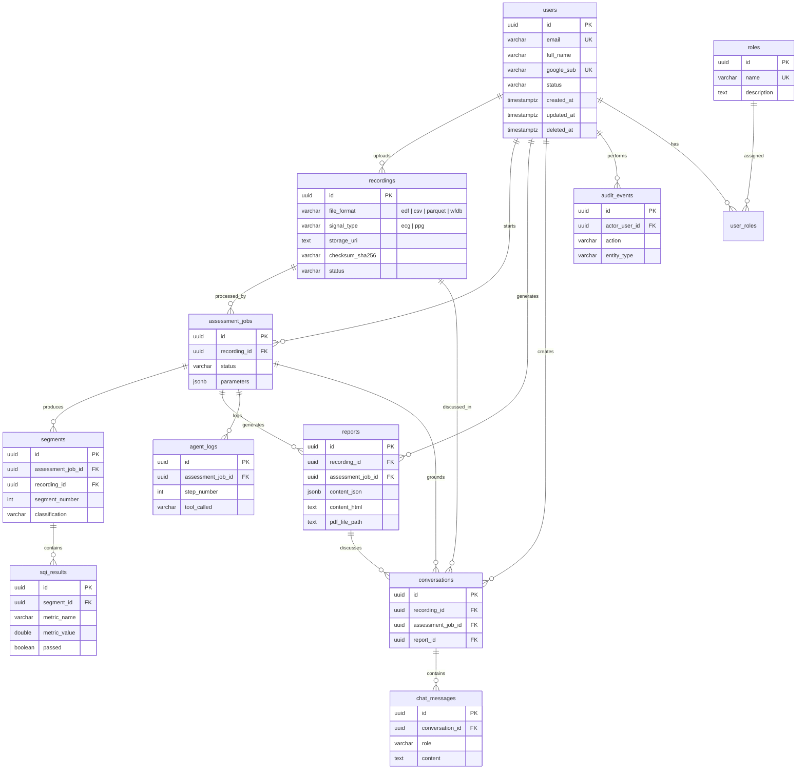

# 11 — Data Model

[← Back to Index](../00-index.md)

---

## Overview

This document defines the PostgreSQL schema for OUCRU Vital Agent. The model prioritizes clear run lineage, auditability, role-based access, report traceability, governed human override history, and simple MVP implementation.

Classification contract:
- `segments.classification` is the immutable AI-generated label from an assessment job.
- Human review creates append-only `segment_override_events`; it never mutates `segments.classification`.
- `effective_classification` is a derived read-model value: active override label if one exists, otherwise `segments.classification`.
- A report is stale when `reports.generated_at` is earlier than the latest active override event affecting any segment included in that report.

The core lineage is:

```text
recordings → assessment_jobs → segments → sqi_results
segments → segment_override_events
assessment_jobs → reports
assessment_jobs → agent_logs
recordings/reports/jobs → conversations → chat_messages
```

---

## Audit Field Policy

Mutable business entities use consistent audit fields:

```sql
created_at TIMESTAMPTZ NOT NULL DEFAULT NOW(),
updated_at TIMESTAMPTZ NOT NULL DEFAULT NOW(),
deleted_at TIMESTAMPTZ,
created_by UUID REFERENCES users(id),
updated_by UUID REFERENCES users(id),
deleted_by UUID REFERENCES users(id)
```

Use `deleted_at IS NULL` to filter active rows. Generated outputs and logs are append-only and use only `created_at` / `created_by` where applicable.

| Table type | Tables | Audit policy |
|---|---|---|
| Mutable business entities | `users`, `roles`, `user_roles`, `recordings`, `assessment_jobs`, `reports`, `conversations`, `chat_messages`, `settings` | Full audit fields + soft delete |
| Generated outputs | `segments`, `sqi_results` | Append-only; new assessment job creates new outputs |
| Logs/events | `agent_logs`, `audit_events`, `segment_override_events` | Append-only; never update/delete in normal operation |

---

## Entity Relationship Description

```text
users             (1) ──────< (many) recordings
users             (1) ──────< (many) assessment_jobs
users             (many) >────< (many) roles via user_roles

recordings        (1) ──────< (many) assessment_jobs
assessment_jobs   (1) ──────< (many) segments
segments          (1) ──────< (many) sqi_results
segments          (1) ──────< (many) segment_override_events
assessment_jobs   (1) ──────< (many) reports
assessment_jobs   (1) ──────< (many) agent_logs

recordings        (1) ──────< (many) conversations
assessment_jobs   (1) ──────< (many) conversations optional
reports           (1) ──────< (many) conversations optional
conversations     (1) ──────< (many) chat_messages

audit_events      append-only system/user activity log
settings          standalone runtime configuration
```

### ERD Diagram



---

## Common SQL Helpers

```sql
CREATE EXTENSION IF NOT EXISTS "pgcrypto";

CREATE OR REPLACE FUNCTION update_updated_at_column()
RETURNS TRIGGER AS $$
BEGIN
    NEW.updated_at = NOW();
    RETURN NEW;
END;
$$ LANGUAGE plpgsql;
```

---

## CREATE TABLE Statements

### 1. `users`

Stores Google OAuth identities and account status.

```sql
CREATE TABLE users (
    id          UUID PRIMARY KEY DEFAULT gen_random_uuid(),
    email       VARCHAR(255) NOT NULL UNIQUE,
    full_name   VARCHAR(255),
    google_sub  VARCHAR(255) UNIQUE,
    avatar_url  TEXT,
    status      VARCHAR(20) NOT NULL DEFAULT 'active'
                    CHECK (status IN ('active', 'disabled')),

    created_at  TIMESTAMPTZ NOT NULL DEFAULT NOW(),
    updated_at  TIMESTAMPTZ NOT NULL DEFAULT NOW(),
    deleted_at  TIMESTAMPTZ,
    created_by  UUID REFERENCES users(id),
    updated_by  UUID REFERENCES users(id),
    deleted_by  UUID REFERENCES users(id)
);

CREATE TRIGGER users_updated_at
    BEFORE UPDATE ON users
    FOR EACH ROW EXECUTE FUNCTION update_updated_at_column();
```

**Indexes:**

```sql
CREATE INDEX idx_users_status ON users (status) WHERE deleted_at IS NULL;
CREATE INDEX idx_users_email_active ON users (email) WHERE deleted_at IS NULL;
```

---

### 2. `roles`

Stores role names for RBAC.

```sql
CREATE TABLE roles (
    id          UUID PRIMARY KEY DEFAULT gen_random_uuid(),
    name        VARCHAR(50) NOT NULL UNIQUE
                    CHECK (name IN ('admin', 'researcher', 'reviewer', 'readonly')),
    description TEXT,

    created_at  TIMESTAMPTZ NOT NULL DEFAULT NOW(),
    updated_at  TIMESTAMPTZ NOT NULL DEFAULT NOW(),
    deleted_at  TIMESTAMPTZ,
    created_by  UUID REFERENCES users(id),
    updated_by  UUID REFERENCES users(id),
    deleted_by  UUID REFERENCES users(id)
);

CREATE TRIGGER roles_updated_at
    BEFORE UPDATE ON roles
    FOR EACH ROW EXECUTE FUNCTION update_updated_at_column();
```

---

### 3. `user_roles`

Maps users to one or more roles.

```sql
CREATE TABLE user_roles (
    id          UUID PRIMARY KEY DEFAULT gen_random_uuid(),
    user_id     UUID NOT NULL REFERENCES users(id) ON DELETE CASCADE,
    role_id     UUID NOT NULL REFERENCES roles(id) ON DELETE CASCADE,

    created_at  TIMESTAMPTZ NOT NULL DEFAULT NOW(),
    updated_at  TIMESTAMPTZ NOT NULL DEFAULT NOW(),
    deleted_at  TIMESTAMPTZ,
    created_by  UUID REFERENCES users(id),
    updated_by  UUID REFERENCES users(id),
    deleted_by  UUID REFERENCES users(id)
);

CREATE TRIGGER user_roles_updated_at
    BEFORE UPDATE ON user_roles
    FOR EACH ROW EXECUTE FUNCTION update_updated_at_column();

CREATE UNIQUE INDEX idx_user_roles_active_unique
    ON user_roles (user_id, role_id)
    WHERE deleted_at IS NULL;
```

---

### 4. `recordings`

Stores uploaded ECG/PPG file metadata. Files are assumed de-identified before upload.

```sql
CREATE TABLE recordings (
    id                  UUID PRIMARY KEY DEFAULT gen_random_uuid(),
    filename            VARCHAR(255) NOT NULL,
    original_filename   VARCHAR(255) NOT NULL,
    file_format         VARCHAR(20)  NOT NULL
                            CHECK (file_format IN ('edf', 'csv', 'parquet', 'wfdb')),
    signal_type         VARCHAR(5)   NOT NULL CHECK (signal_type IN ('ecg', 'ppg')),
    sampling_rate       INTEGER      NOT NULL CHECK (sampling_rate > 0),
    duration_seconds    DOUBLE PRECISION,
    channel_count       INTEGER      NOT NULL DEFAULT 1 CHECK (channel_count > 0),
    file_size_bytes     BIGINT       NOT NULL CHECK (file_size_bytes > 0),
    checksum_sha256     VARCHAR(64),
    storage_uri         TEXT         NOT NULL,
    subject_id          VARCHAR(100),
    device_id           VARCHAR(100),
    notes               TEXT,
    agent_summary       JSONB,
    status              VARCHAR(20)  NOT NULL DEFAULT 'uploaded'
                            CHECK (status IN ('uploaded', 'processing', 'completed', 'failed')),

    created_at          TIMESTAMPTZ NOT NULL DEFAULT NOW(),
    updated_at          TIMESTAMPTZ NOT NULL DEFAULT NOW(),
    deleted_at          TIMESTAMPTZ,
    created_by          UUID REFERENCES users(id),
    updated_by          UUID REFERENCES users(id),
    deleted_by          UUID REFERENCES users(id)
);

CREATE TRIGGER recordings_updated_at
    BEFORE UPDATE ON recordings
    FOR EACH ROW EXECUTE FUNCTION update_updated_at_column();
```

**Indexes:**

```sql
CREATE INDEX idx_recordings_status ON recordings (status) WHERE deleted_at IS NULL;
CREATE INDEX idx_recordings_created_at ON recordings (created_at DESC) WHERE deleted_at IS NULL;
CREATE INDEX idx_recordings_signal_type ON recordings (signal_type) WHERE deleted_at IS NULL;
CREATE INDEX idx_recordings_created_by ON recordings (created_by) WHERE deleted_at IS NULL;
CREATE INDEX idx_recordings_checksum ON recordings (checksum_sha256) WHERE deleted_at IS NULL;
```

---

### 5. `assessment_jobs`

Tracks each assessment run for a recording. Re-running a recording creates a new job and new downstream outputs.

```sql
CREATE TABLE assessment_jobs (
    id                  UUID PRIMARY KEY DEFAULT gen_random_uuid(),
    recording_id        UUID NOT NULL REFERENCES recordings(id) ON DELETE CASCADE,
    status              VARCHAR(20) NOT NULL DEFAULT 'queued'
                            CHECK (status IN ('queued', 'processing', 'completed', 'failed', 'cancelled')),
    current_step        VARCHAR(80),
    progress_pct        NUMERIC(5,2) DEFAULT 0 CHECK (progress_pct >= 0 AND progress_pct <= 100),
    total_segments      INTEGER CHECK (total_segments IS NULL OR total_segments >= 0),
    processed_segments  INTEGER DEFAULT 0 CHECK (processed_segments >= 0),
    parameters          JSONB,
    error_message       TEXT,
    started_at          TIMESTAMPTZ,
    completed_at        TIMESTAMPTZ,

    created_at          TIMESTAMPTZ NOT NULL DEFAULT NOW(),
    updated_at          TIMESTAMPTZ NOT NULL DEFAULT NOW(),
    deleted_at          TIMESTAMPTZ,
    created_by          UUID REFERENCES users(id),
    updated_by          UUID REFERENCES users(id),
    deleted_by          UUID REFERENCES users(id),

    CONSTRAINT assessment_jobs_segment_counts_valid
        CHECK (total_segments IS NULL OR processed_segments <= total_segments)
);

CREATE TRIGGER assessment_jobs_updated_at
    BEFORE UPDATE ON assessment_jobs
    FOR EACH ROW EXECUTE FUNCTION update_updated_at_column();
```

**Indexes:**

```sql
CREATE INDEX idx_assessment_jobs_recording ON assessment_jobs (recording_id, created_at DESC)
    WHERE deleted_at IS NULL;
CREATE INDEX idx_assessment_jobs_status ON assessment_jobs (status)
    WHERE deleted_at IS NULL AND status IN ('queued', 'processing');
CREATE INDEX idx_assessment_jobs_created_by ON assessment_jobs (created_by)
    WHERE deleted_at IS NULL;
```

---

### 6. `segments`

Stores generated time windows for one assessment job. Segments are append-only outputs.

```sql
CREATE TABLE segments (
    id                  UUID PRIMARY KEY DEFAULT gen_random_uuid(),
    assessment_job_id   UUID NOT NULL REFERENCES assessment_jobs(id) ON DELETE CASCADE,
    recording_id        UUID NOT NULL REFERENCES recordings(id) ON DELETE CASCADE,
    segment_number      INTEGER NOT NULL CHECK (segment_number >= 0),
    start_time          DOUBLE PRECISION NOT NULL CHECK (start_time >= 0),
    end_time            DOUBLE PRECISION NOT NULL,
    duration            DOUBLE PRECISION NOT NULL CHECK (duration > 0),
    classification      VARCHAR(20) NOT NULL DEFAULT 'pending'
                            CHECK (classification IN ('accept', 'reject', 'pending', 'uncomputable')),
    quality_score       DOUBLE PRECISION CHECK (quality_score >= 0 AND quality_score <= 1),
    sqi_summary         JSONB,
    created_at          TIMESTAMPTZ NOT NULL DEFAULT NOW(),
    created_by          UUID REFERENCES users(id),

    CONSTRAINT segments_time_order CHECK (end_time > start_time),
    CONSTRAINT segments_job_segment_unique UNIQUE (assessment_job_id, segment_number)
);
```

**Indexes:**

```sql
CREATE INDEX idx_segments_job ON segments (assessment_job_id, segment_number ASC);
CREATE INDEX idx_segments_recording ON segments (recording_id, segment_number ASC);
CREATE INDEX idx_segments_classification ON segments (assessment_job_id, classification);
CREATE INDEX idx_segments_pending ON segments (assessment_job_id, classification)
    WHERE classification = 'pending';
```

---

### 7. `sqi_results`

Stores SQI and clinical-feature metric values for each segment. Rows are append-only outputs.

```sql
CREATE TABLE sqi_results (
    id               UUID PRIMARY KEY DEFAULT gen_random_uuid(),
    segment_id       UUID NOT NULL REFERENCES segments(id) ON DELETE CASCADE,
    metric_name      VARCHAR(80) NOT NULL,
    metric_category  VARCHAR(40) NOT NULL
                         CHECK (metric_category IN (
                             'statistical', 'signal_processing', 'cardiac',
                             'hrv_time', 'hrv_frequency', 'waveform',
                             'nonlinear', 'clinical'
                         )),
    metric_value     DOUBLE PRECISION,
    threshold_min    DOUBLE PRECISION,
    threshold_max    DOUBLE PRECISION,
    passed           BOOLEAN,
    created_at       TIMESTAMPTZ NOT NULL DEFAULT NOW(),
    created_by       UUID REFERENCES users(id),

    CONSTRAINT sqi_results_segment_metric_unique UNIQUE (segment_id, metric_name)
);
```

**Indexes:**

```sql
CREATE INDEX idx_sqi_results_segment ON sqi_results (segment_id);
CREATE INDEX idx_sqi_results_metric_name ON sqi_results (metric_name);
CREATE INDEX idx_sqi_results_failed ON sqi_results (segment_id, passed)
    WHERE passed = FALSE;
CREATE INDEX idx_sqi_results_category ON sqi_results (metric_category, metric_name);
```

---

### 8. `segment_override_events`

Stores append-only human override events for segments. This table captures reviewer/admin adjudication without overwriting the original AI output in `segments.classification`.

```sql
CREATE TABLE segment_override_events (
    id                           UUID PRIMARY KEY DEFAULT gen_random_uuid(),
    segment_id                   UUID NOT NULL REFERENCES segments(id) ON DELETE CASCADE,
    recording_id                 UUID NOT NULL REFERENCES recordings(id) ON DELETE CASCADE,
    assessment_job_id            UUID NOT NULL REFERENCES assessment_jobs(id) ON DELETE CASCADE,
    label                        VARCHAR(20) NOT NULL CHECK (label IN ('accept', 'reject')),
    reason_category              VARCHAR(80) NOT NULL,
    note                         TEXT NOT NULL,
    supersedes_override_event_id UUID REFERENCES segment_override_events(id),
    created_at                   TIMESTAMPTZ NOT NULL DEFAULT NOW(),
    created_by                   UUID NOT NULL REFERENCES users(id),

    CONSTRAINT segment_override_events_self_reference_check
        CHECK (supersedes_override_event_id IS NULL OR supersedes_override_event_id <> id)
);
```

**Indexes:**

```sql
CREATE INDEX idx_segment_override_events_segment_created_at
    ON segment_override_events (segment_id, created_at DESC);
CREATE INDEX idx_segment_override_events_recording_created_at
    ON segment_override_events (recording_id, created_at DESC);
CREATE INDEX idx_segment_override_events_supersedes
    ON segment_override_events (supersedes_override_event_id);
```

**Semantics:**

- Override events are append-only.
- Creating a replacement override inserts a new row that references the superseded event via `supersedes_override_event_id`.
- The active override for a segment is the newest override event that has not itself been superseded by a newer event.
- `effective_classification` is derived at read time from the active override, not stored by mutating the `segments` row.

### 9. `reports`

Stores the canonical JSON report plus optional rendered HTML and PDF path. No separate export table is needed for MVP.

```sql
CREATE TABLE reports (
    id                   UUID PRIMARY KEY DEFAULT gen_random_uuid(),
    recording_id         UUID NOT NULL REFERENCES recordings(id) ON DELETE CASCADE,
    assessment_job_id    UUID NOT NULL REFERENCES assessment_jobs(id) ON DELETE CASCADE,
    title                VARCHAR(255) NOT NULL,
    content_json         JSONB NOT NULL,
    content_html         TEXT,
    pdf_file_path        TEXT,
    json_schema_version  VARCHAR(20) NOT NULL DEFAULT '1.0',
    generated_at         TIMESTAMPTZ NOT NULL DEFAULT NOW(),

    created_at           TIMESTAMPTZ NOT NULL DEFAULT NOW(),
    updated_at           TIMESTAMPTZ NOT NULL DEFAULT NOW(),
    deleted_at           TIMESTAMPTZ,
    created_by           UUID REFERENCES users(id),
    updated_by           UUID REFERENCES users(id),
    deleted_by           UUID REFERENCES users(id)
);

CREATE TRIGGER reports_updated_at
    BEFORE UPDATE ON reports
    FOR EACH ROW EXECUTE FUNCTION update_updated_at_column();
```

**Indexes:**

```sql
CREATE INDEX idx_reports_recording ON reports (recording_id, generated_at DESC)
    WHERE deleted_at IS NULL;
CREATE INDEX idx_reports_job ON reports (assessment_job_id)
    WHERE deleted_at IS NULL;
CREATE INDEX idx_reports_content_json ON reports USING GIN (content_json);
```

---

### 10. `conversations`

Groups chatbot messages into a thread scoped to a recording and optionally grounded in one job/report.

```sql
CREATE TABLE conversations (
    id                  UUID PRIMARY KEY DEFAULT gen_random_uuid(),
    recording_id        UUID NOT NULL REFERENCES recordings(id) ON DELETE CASCADE,
    assessment_job_id   UUID REFERENCES assessment_jobs(id) ON DELETE SET NULL,
    report_id           UUID REFERENCES reports(id) ON DELETE SET NULL,
    title               VARCHAR(255),

    created_at          TIMESTAMPTZ NOT NULL DEFAULT NOW(),
    updated_at          TIMESTAMPTZ NOT NULL DEFAULT NOW(),
    deleted_at          TIMESTAMPTZ,
    created_by          UUID REFERENCES users(id),
    updated_by          UUID REFERENCES users(id),
    deleted_by          UUID REFERENCES users(id)
);

CREATE TRIGGER conversations_updated_at
    BEFORE UPDATE ON conversations
    FOR EACH ROW EXECUTE FUNCTION update_updated_at_column();
```

**Indexes:**

```sql
CREATE INDEX idx_conversations_recording ON conversations (recording_id, created_at DESC)
    WHERE deleted_at IS NULL;
CREATE INDEX idx_conversations_report ON conversations (report_id)
    WHERE deleted_at IS NULL;
CREATE INDEX idx_conversations_created_by ON conversations (created_by)
    WHERE deleted_at IS NULL;
```

---

### 10. `chat_messages`

Stores messages inside a conversation.

```sql
CREATE TABLE chat_messages (
    id               UUID PRIMARY KEY DEFAULT gen_random_uuid(),
    conversation_id  UUID NOT NULL REFERENCES conversations(id) ON DELETE CASCADE,
    role             VARCHAR(20) NOT NULL CHECK (role IN ('user', 'assistant', 'system')),
    content          TEXT NOT NULL,
    sources          JSONB,
    token_count      INTEGER CHECK (token_count IS NULL OR token_count >= 0),

    created_at       TIMESTAMPTZ NOT NULL DEFAULT NOW(),
    updated_at       TIMESTAMPTZ NOT NULL DEFAULT NOW(),
    deleted_at       TIMESTAMPTZ,
    created_by       UUID REFERENCES users(id),
    updated_by       UUID REFERENCES users(id),
    deleted_by       UUID REFERENCES users(id)
);

CREATE TRIGGER chat_messages_updated_at
    BEFORE UPDATE ON chat_messages
    FOR EACH ROW EXECUTE FUNCTION update_updated_at_column();
```

**Indexes:**

```sql
CREATE INDEX idx_chat_messages_conversation ON chat_messages (conversation_id, created_at ASC)
    WHERE deleted_at IS NULL;
CREATE INDEX idx_chat_messages_created_by ON chat_messages (created_by)
    WHERE deleted_at IS NULL;
```

---

### 11. `agent_logs`

Append-only tool-call and reasoning trace for one assessment job.

```sql
CREATE TABLE agent_logs (
    id                  UUID PRIMARY KEY DEFAULT gen_random_uuid(),
    assessment_job_id   UUID NOT NULL REFERENCES assessment_jobs(id) ON DELETE CASCADE,
    recording_id        UUID NOT NULL REFERENCES recordings(id) ON DELETE CASCADE,
    step_number         INTEGER NOT NULL CHECK (step_number >= 0),
    stage               VARCHAR(40) NOT NULL
                            CHECK (stage IN (
                                'initialized', 'loading', 'preprocessing',
                                'assessing', 'interpreting', 'reporting',
                                'completed', 'error'
                            )),
    tool_called         VARCHAR(80),
    input_params        JSONB,
    output_summary      TEXT,
    reasoning           TEXT,
    duration_ms         INTEGER CHECK (duration_ms IS NULL OR duration_ms >= 0),
    status              VARCHAR(20) NOT NULL DEFAULT 'success'
                            CHECK (status IN ('success', 'error', 'timeout', 'skipped')),
    error_detail        TEXT,
    created_at          TIMESTAMPTZ NOT NULL DEFAULT NOW(),
    created_by          UUID REFERENCES users(id),

    CONSTRAINT agent_logs_job_step_unique UNIQUE (assessment_job_id, step_number)
);
```

**Indexes:**

```sql
CREATE INDEX idx_agent_logs_job ON agent_logs (assessment_job_id, step_number ASC);
CREATE INDEX idx_agent_logs_recording ON agent_logs (recording_id, created_at DESC);
CREATE INDEX idx_agent_logs_tool_called ON agent_logs (tool_called);
CREATE INDEX idx_agent_logs_status ON agent_logs (status)
    WHERE status IN ('error', 'timeout');
CREATE INDEX idx_agent_logs_input_params ON agent_logs USING GIN (input_params);
```

---

### 12. `audit_events`

Append-only user/system activity log. This is separate from agent reasoning logs.

```sql
CREATE TABLE audit_events (
    id              UUID PRIMARY KEY DEFAULT gen_random_uuid(),
    actor_user_id   UUID REFERENCES users(id),
    action          VARCHAR(80) NOT NULL,
    entity_type     VARCHAR(80) NOT NULL,
    entity_id       UUID,
    details         JSONB,
    request_id      VARCHAR(100),
    ip_address      INET,
    user_agent      TEXT,
    created_at      TIMESTAMPTZ NOT NULL DEFAULT NOW()
);
```

**Indexes:**

```sql
CREATE INDEX idx_audit_events_actor ON audit_events (actor_user_id, created_at DESC);
CREATE INDEX idx_audit_events_entity ON audit_events (entity_type, entity_id, created_at DESC);
CREATE INDEX idx_audit_events_action ON audit_events (action, created_at DESC);
```

Example actions: `recording_uploaded`, `assessment_started`, `settings_updated`, `report_generated`, `recording_deleted`, `user_role_changed`.

---

### 13. `settings`

Stores admin-editable runtime configuration. Do not store secrets here; use `.env` or Google Secret Manager for credentials.

```sql
CREATE TABLE settings (
    id          UUID PRIMARY KEY DEFAULT gen_random_uuid(),
    key         VARCHAR(100) NOT NULL,
    value       JSONB NOT NULL,
    category    VARCHAR(40) NOT NULL
                    CHECK (category IN ('sqi', 'segmentation', 'agent', 'clinical', 'ui')),
    description TEXT,

    created_at  TIMESTAMPTZ NOT NULL DEFAULT NOW(),
    updated_at  TIMESTAMPTZ NOT NULL DEFAULT NOW(),
    deleted_at  TIMESTAMPTZ,
    created_by  UUID REFERENCES users(id),
    updated_by  UUID REFERENCES users(id),
    deleted_by  UUID REFERENCES users(id)
);

CREATE TRIGGER settings_updated_at
    BEFORE UPDATE ON settings
    FOR EACH ROW EXECUTE FUNCTION update_updated_at_column();
```

**Indexes:**

```sql
CREATE UNIQUE INDEX idx_settings_key ON settings (key) WHERE deleted_at IS NULL;
CREATE INDEX idx_settings_category ON settings (category) WHERE deleted_at IS NULL;
```

**Seed data examples:**

```sql
INSERT INTO roles (name, description) VALUES
('admin', 'Full system administration'),
('researcher', 'Upload recordings and run assessments'),
('reviewer', 'Review reports and inspect results'),
('readonly', 'Read-only access to completed results');

INSERT INTO settings (key, category, value, description) VALUES
(
    'sqi_thresholds',
    'sqi',
    '{
        "snr": {"min": 8.0, "max": null},
        "kurtosis": {"min": -1.5, "max": 10.0},
        "perfusion_index": {"min": 0.5, "max": null},
        "zero_crossing_rate": {"min": null, "max": 0.5},
        "skewness": {"min": -2.0, "max": 2.0}
    }',
    'SQI metric thresholds for accept/reject classification. null means no bound.'
),
(
    'segmentation_config',
    'segmentation',
    '{
        "window_duration_seconds": 30,
        "overlap_seconds": 0,
        "split_type": "time",
        "min_segment_duration": 5
    }',
    'Default segmentation parameters applied to all recordings.'
),
(
    'agent_config',
    'agent',
    '{
        "max_steps": 20,
        "model": "qwen3:8b",
        "base_url": "http://ollama:11434",
        "temperature": 0.1,
        "timeout_seconds": 300
    }',
    'smolagents and Ollama execution parameters.'
);
```

---

## Common Query Patterns

```sql
-- Latest assessment summary for each active recording
SELECT
    r.id,
    r.original_filename,
    r.status,
    r.duration_seconds,
    j.id AS assessment_job_id,
    COUNT(s.id) AS total_segments,
    SUM(CASE WHEN s.classification = 'accept' THEN 1 ELSE 0 END) AS accepted,
    SUM(CASE WHEN s.classification = 'reject' THEN 1 ELSE 0 END) AS rejected,
    ROUND(
        SUM(CASE WHEN s.classification = 'accept' THEN 1 ELSE 0 END)::NUMERIC
        / NULLIF(COUNT(s.id), 0) * 100, 2
    ) AS accept_ratio_pct
FROM recordings r
LEFT JOIN LATERAL (
    SELECT * FROM assessment_jobs aj
    WHERE aj.recording_id = r.id AND aj.deleted_at IS NULL
    ORDER BY aj.created_at DESC
    LIMIT 1
) j ON TRUE
LEFT JOIN segments s ON s.assessment_job_id = j.id
WHERE r.deleted_at IS NULL
GROUP BY r.id, j.id;

-- All SQI results for one assessment job
SELECT
    s.segment_number,
    s.start_time,
    s.end_time,
    s.classification,
    s.quality_score,
    sq.metric_name,
    sq.metric_category,
    sq.metric_value,
    sq.passed
FROM segments s
JOIN sqi_results sq ON sq.segment_id = s.id
WHERE s.assessment_job_id = $1
ORDER BY s.segment_number, sq.metric_category, sq.metric_name;

-- Failed metrics summary for one assessment job
SELECT
    sq.metric_name,
    sq.metric_category,
    COUNT(*) AS fail_count,
    AVG(sq.metric_value) AS avg_value
FROM segments s
JOIN sqi_results sq ON sq.segment_id = s.id
WHERE s.assessment_job_id = $1 AND sq.passed = FALSE
GROUP BY sq.metric_name, sq.metric_category
ORDER BY fail_count DESC;

-- Conversation messages for a report-grounded chat
SELECT
    m.role,
    m.content,
    m.sources,
    m.created_at
FROM conversations c
JOIN chat_messages m ON m.conversation_id = c.id
WHERE c.report_id = $1
  AND c.deleted_at IS NULL
  AND m.deleted_at IS NULL
ORDER BY m.created_at ASC;

-- Assessment job progress
SELECT
    j.id,
    j.status,
    j.current_step,
    j.progress_pct,
    j.processed_segments,
    j.total_segments,
    j.error_message
FROM assessment_jobs j
WHERE j.recording_id = $1 AND j.deleted_at IS NULL
ORDER BY j.created_at DESC
LIMIT 1;
```

---

## Migration Strategy

Migrations are managed via **Alembic**. Each schema change is versioned and applied sequentially.

```text
alembic/
├── env.py
├── versions/
│   ├── 0001_create_auth_tables.py
│   ├── 0002_create_recordings.py
│   ├── 0003_create_assessment_jobs.py
│   ├── 0004_create_segments.py
│   ├── 0005_create_sqi_results.py
│   ├── 0006_create_reports.py
│   ├── 0007_create_conversations.py
│   ├── 0008_create_chat_messages.py
│   ├── 0009_create_agent_logs.py
│   ├── 0010_create_audit_events.py
│   └── 0011_create_settings.py
```

Run migrations: `alembic upgrade head`
Rollback: `alembic downgrade -1`
